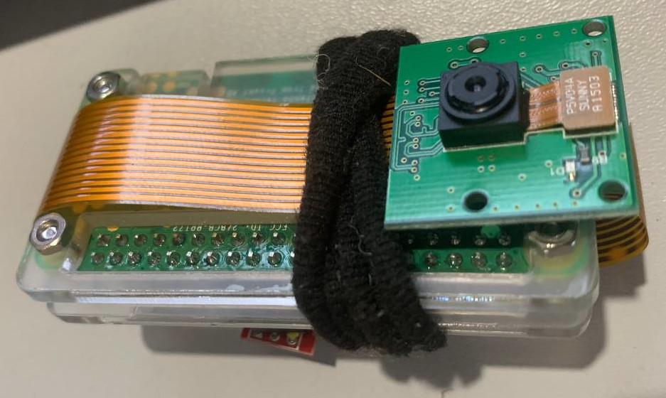
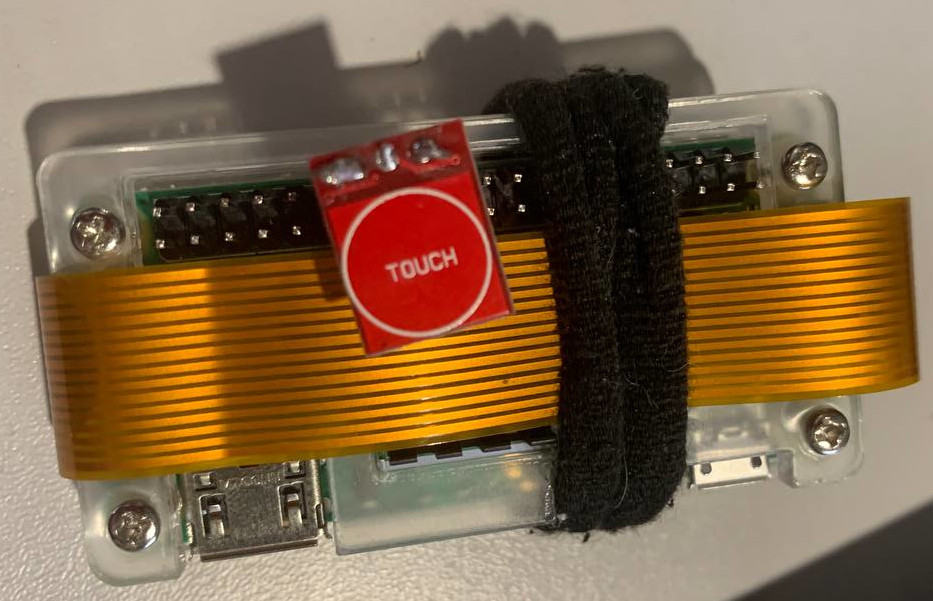

---
---

pi-n-hole
=========

An experience on turning a Raspberry Pi Zero W in a pinhole camera.


Hardware
--------

For this experiment, I used:

* A Raspberry Pi Zero W 2
    * I wanted to use an original Zero W, but due to time constraints I was not able to solder the pins to the board, it should, however, work.
* A Raspberry Pi Camera Module
* A [TTP223](https://www.instructables.com/Tutorial-for-TTP223-Touch-Sensor-Module-Capacitive) touch sensor module

Simply tie the TTP223 module to pins 17 (3.3V -> VCC), 16 (GPIO24 -> I/O) and 14 (GND).

This is how the device looks:

[](docs/images/device_front.jpg)
[](docs/images/device_back.jpg)

Note the rubber finish on the body!


Software
--------

I'll just use [picamera2](https://github.com/RaspberryPi/picamera2) to grab images from the camera, and [gpiod/libgpio](https://pypi.org/project/gpiod/) to read events of the TTP223 module connected to Raspberry PI GPIO bus.

Currently, it has only been tested under RaspiOS Bookworm (Debian 12).


Build and Install
-----------------

You can build and install the project using pip. From the repository root directory:

```
pip install .
```

To contribute with development, you should have the development packages:

```
pip install .[dev]
```

Note that for both use and develop `pi-n-hole`, some packages might be needed, so you may want to query your package manager to install:

- libgpiod
- libcap-dev
- python-dev

If you want to use your package manager to install the Python packages, the requirements are:

- python3-picamera2
- python3-gpiod


Know Issues
-----------

If you are using a virtual environment, you'll need do allow system packages usage, due to some issue with `libcamera` (a `picamera2` dependency):

```
python3 -m venv --system-site-packages /tmp/venv
. /tmp/venv/bin/activate
```


License
-------

If you are brave enough to use this code, it is licensed under BSD 0-clause.

Use at your own risk.


Author
------

Rafael Jeffman (@rafasgj)
